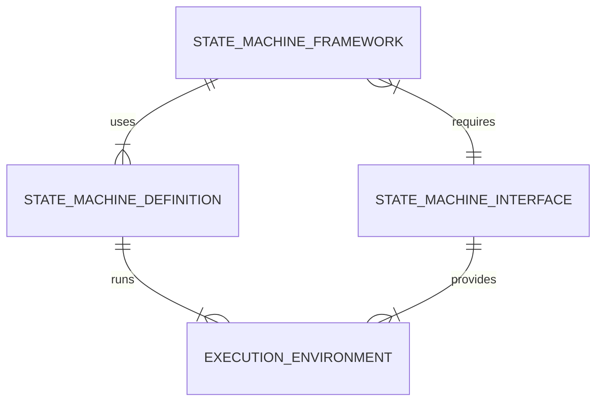

# State machine experiments

This repository contains a Rust workspace project to deal with various state machine concepts and implementations.

## General

## State machine frameworks

* Quantum Leap Rust like state machine framework: [QLRL](qlrl/README.md)

## State machine execution environments

The runtime, aka state machine execution environments are extracted into dedicated crates.

* Threaded context on host computer: [Threaded Context Crate ](runtime_contexts/threads-on-host/Cargo.toml)

## Examples

Examples are orgainized in a dedicated crate. See the [README.md](example-apps/README.md) of that crate

## TODO

- Event: Require PartialEq
- Complete table details
- tdd tests for fsm
- hsm

## License

Licensed under MIT license [LICENSE-MIT](LICENSE-MIT).
